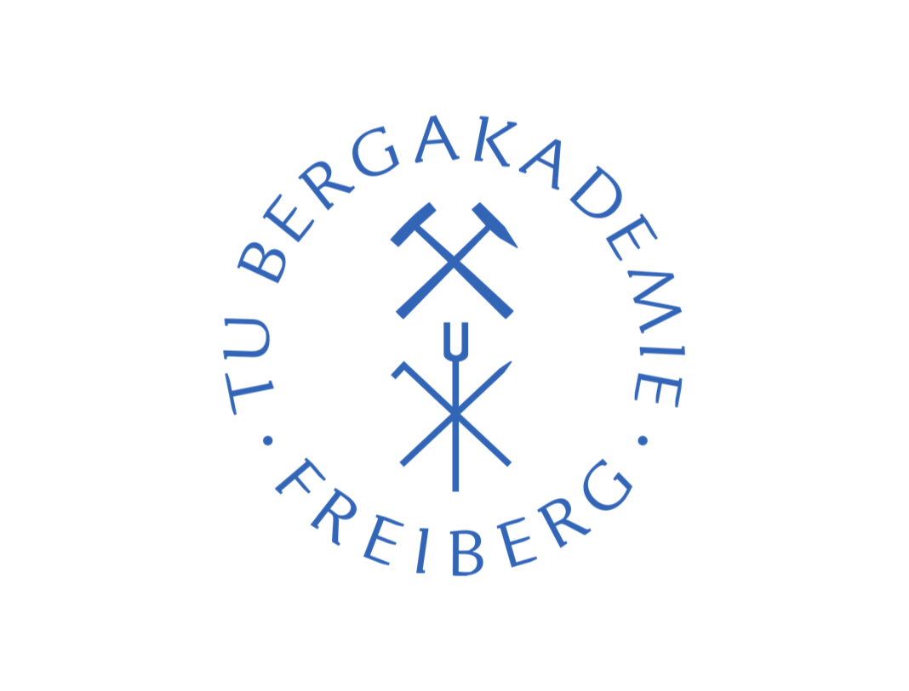

About
=====

* simcoon is a scientific library built to facilitate the analysis of mechanics of materials.
* It is built on the top of Armadillo, a high quality C++ linear algebra library. It also utilizes FTensor for some complex tensor operations
* It integrates several algorithms for the analysis of heterogeneous materials
* Enjoy!

simcoon is a C++ library with emphasis on speed and ease-of-use. Its principle focus is to provide tools to facilitate the implementation of up-to-date constitutive model for materials in Finite Element Analysis Packages. This is done by providing a C++ and a Python API to generate user material subroutine based on a library of functions. Also, simcoon provides tools to analyse the behavior of material, considering loading at the material point level.

Simcoon is mainly developed by contributors from the staff and students of University of Bordeaux and I2M (Institut de Mécanique et d'Ingénierie). It is released under the GNU General Public License: GPL, version 3.
Several institutions have contributed to the development of simcoon:

* **LEM3 Laboratory**: University of Bordeaux, France.
* **I2M Laboratory**: Institut de Mécanique et d'Ingénierie, Bordeaux, France.
* **LEM3 Laboratory**: Laboratory for the study of Materials, Microstructures and Mechanics, Metz, Germany.
* **TU Bergakademie Freiberg**: School of Mines and Technical University in Freiberg, Germany.
* **CNRS**: National French Center for scientific research.

