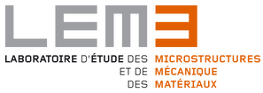

About
=====

* SMART+ is a scientific library built to facilitate the analysis of mechanics of materials.
* It is built on the top of Armadillo, a high quality C++ linear algebra library.
* It integrates several algorithms for the analysis of heterogeneous materials
* Enjoy!

SMART+ is a C++ library with emphasis on speed and ease-of-use. Its principle focus is to provide tools to facilitate the implementation of up-to-date constitutive model for materials in Finite Element Analysis Packages. This is done by providing a C++ API to generate user material subroutine based on a library of functions. Also, SMART+ provides tools to analyse the behavior of material, considering loading at the material point level.

SMART+ is mainly developed by contributors from the staff and students of Arts et Métiers ParisTech, that are members of the LEM3 laboratory. It is released under the GNU General Public License: GPL, version 3.
Several institutions have contributed to the development of SMART+:

* **Arts et Métiers ParisTech** : Top French school of engineers, focused on technology and applications.
* **LEM3**: Laboratory devoted to the study of Microstructures and Mechanics of Materials.
* **CNRS**: National French Center for scientific research. The LEM3 laboratory is labelled from the CNRS.
* **Texas A&M University**: Top University in Texas, USA.

