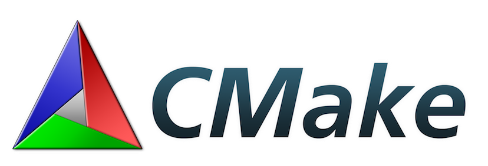
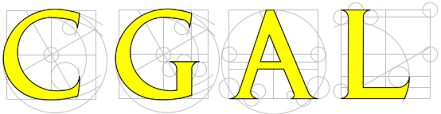

Installation
========

On Unix platforms
----------------

You need to have CMake installed

If not installed, for Ubuntu and debian-based systems:

.. code-block:: none

    sudo apt-get install cmake 

And for Mac OS user, you can use brew:

.. code-block:: none

   brew update
   brew install cmake

The following dependencies are required to install simcoon: 

- Boost_ (at least 1.63), including Boost Python
.. _Boost : https://www.boost.org
- Armadillo_ 
.. _Armadillo : http://arma.sourceforge.net
- CGAL_
.. _CGAL : https://www.cgal.org

Download simcoon from Github_
.. _Github : https://github.com/simcoon/simcoon/

Copy the files in a folder. Using a terminal, nagitate to such folder and run the installation script:

.. code-block:: none

    sh install.sh
    
A build folder will be automatically created. At some point you can decide wether you will install or not the Simcoon library (by default in usr/local/)
You can set up, in the CMakeLists.txt file, the location where the library be installed. 
Once the installation is done, the executables can be found in the build/bin folder

