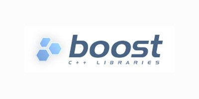

Installation
========

On Unix platforms
----------------

You need to have CMake installed

.. image:: _static/CMake.png

If not installed, I recommend for Ubuntu and debian-based systems

.. code-block:: none

    sudo apt-get install cmake 

And for Mac OS user, you can use brew:

.. code-block:: none

   brew update
   brew install cmake

The following dependencies are required to install simcoon: 

- Boost_ (at least 1.63), including Boost Python
.. _Boost : https://www.boost.org
- Armadillo_ 
.. _Armadillo : http://arma.sourceforge.net
- CGAL_
.. _CGAL : https://www.cgal.org

.. image:: _static/CGAL_logo.png